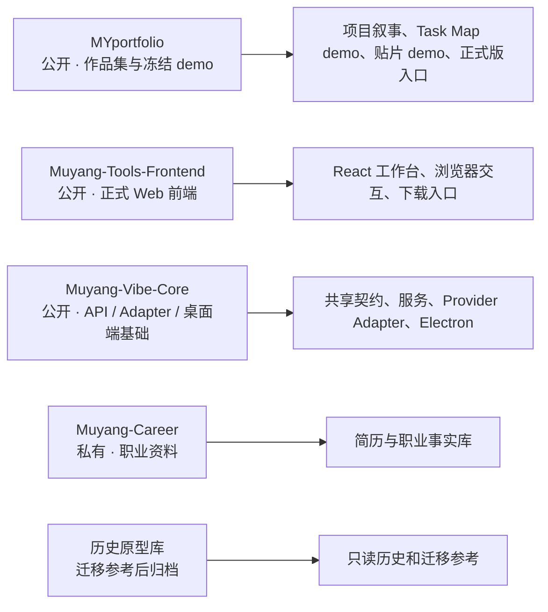
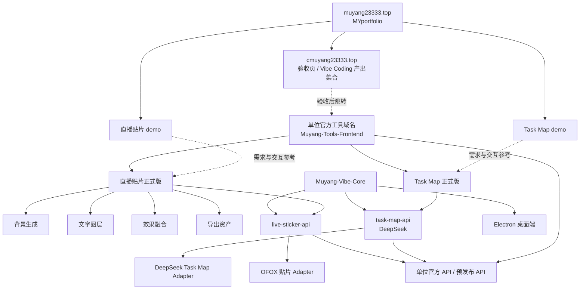

# GitHub 库与产品架构总览

`MYportfolio` 是冻结的作品集与交互 demo；正式开发只发生在 `Muyang-Tools-Frontend` 与 `Muyang-Vibe-Core`。

## 横向：仓库职责

## 纵向：产品与部署关系

## 关键边界

- `cmuyang23333.top` 当前用于验收，后续会成为 Vibe Coding 产出集合并跳转到单位正式工具页；同一前端构建可部署在单位官方服务器。
- Frontend 只通过 `VITE_CORE_API_BASE_URL` 访问 Core，浏览器不能保存 Provider key。
- 单位正式直播贴片工具固定使用 OFOX Adapter，不提供 Provider 选择器；Task Map 仍固定通过 DeepSeek Adapter。
- 背景生成、文字图层、效果融合和导出资产均可独立使用，也可复用同一项目资产。
- 项目配置 JSON、上下贴透明边缘纹理均为后期高级能力，第一期不开放。
